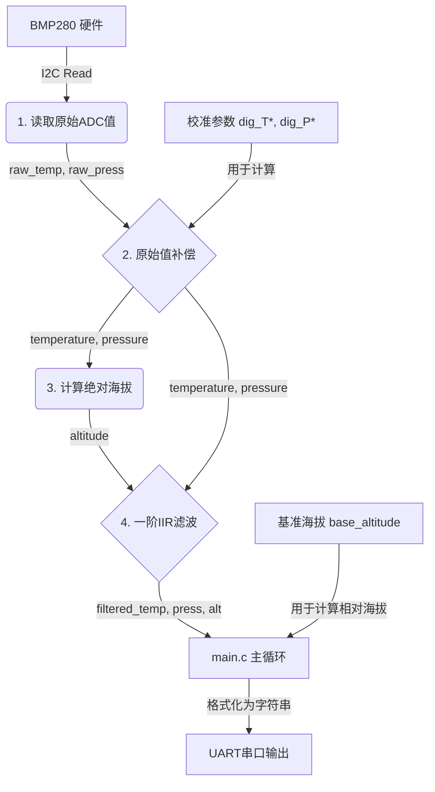

# BMP280 驱动重构与问题排查总结

本次任务旨在解决 BMP280 传感器驱动的几个核心问题，并最终成功完成代码重构，提升了传感器的性能和稳定性。

## 1. 初始问题

原版驱动程序使用**滑动平均滤波器**，导致了以下几个问题：
- **启动延迟严重**：滤波器需要采集足够的数据进行预热，导致程序启动后无法立即获得有效读数。
- **精度与一致性不佳**：由于预热数据的影响，每次上电后的基准值不一致，影响了测量精度。
- **数据跳变**：滤波效果不理想，输出数据仍存在不规律的抖动。

## 2. 解决方案：一阶IIR低通滤波器

为了解决上述问题，我们决定用**一阶IIR（无限脉冲响应）低通滤波器**替换原有的滑动平均滤波器。

**优势**:
- **零启动延迟**：IIR滤波器通过“种子”值进行初始化，无需预热，程序启动后即可输出平滑数据。
- **高效率**：仅需存储上一次的滤波结果，内存占用极低。
- **可调性**：通过调整滤波系数 `alpha`，可以方便地在“响应速度”和“平滑度”之间取得平衡。

## 3. 实施过程与排错记录

在重构过程中，我们遇到并解决了一系列编译和链接问题：

1.  **代码初步重构**：
    *   修改 `bmp280.c`，在 `BMP280_Read_Float` 函数中实现IIR滤波逻辑。
    *   修改 `BMP280_Init` 函数，增加IIR滤波器“播种”（seeding）步骤，即在初始化时读取一次数据作为滤波初始值。
    *   修改 `main.c`，移除主循环前的预热等待。

2.  **解决编译错误 (Compiler Errors)**：
    *   **问题**：`implicit declaration of function` (函数隐式声明)。
    *   **原因**：在 `bmp280.c` 中调用了 `BMP280_Read_Calibration` 等函数，但它们的声明（原型）在 `bmp280.h` 头文件中被误删。
    *   **解决**：在 `bmp280.h` 中恢复了所有必要的函数原型和宏定义。
    *   **问题**：笔误 `BMP280_Read_Calibration`。
    *   **原因**：函数名写错，正确的应为 `BMP280_Read_Calibration_Data`。
    *   **解决**：修正了 `bmp280.c` 中的函数调用。

3.  **解决链接错误 (Linker Errors)**：
    *   **问题**：`undefined reference to 'BMP280_Set_Mode'` 等。
    *   **原因**：虽然在 `.h` 文件中声明了函数（告知编译器有这个函数），但在 `.c` 文件中没有提供这些函数的具体实现代码，导致链接器在最后组装程序时找不到它们。
    *   **解决**：在 `bmp280.c` 中补全了 `BMP280_Set_Mode`, `BMP280_Set_Standby`, `BMP280_Set_Filter` 等所有配置函数的实现。

## 4. 最终成果

经过上述修改，项目成功编译并运行。从 `result.md` 的输出可以看出：
- 数据平滑、稳定，无明显跳变。
- 程序启动后立即输出有效数据，无延迟。
- 相对海拔从 0.00m 开始，表现正常。

整个重构任务圆满完成。

---

## 5. 接口文档 (API Documentation)

这部分文档描述了 `bmp280` 驱动模块的公共接口函数。

### 文件

- **头文件**: `Core/Inc/bmp280.h`
- **源文件**: `Core/Src/bmp280.c`

### 核心数据结构

- `bmp280_t`: 一个全局实例化的结构体，用于存储传感器的所有状态，包括校准参数、原始读数、补偿后的数据以及滤波结果。

### 公共函数 (Public Functions)

#### `uint8_t BMP280_ReadID(I2C_HandleTypeDef *hi2c)`
- **功能**: 读取并返回 BMP280 传感器的芯片 ID。
- **参数**: `hi2c` - I2C总线句柄。
- **返回**: 传感器的 ID，正常情况下应为 `0x58`。

#### `void BMP280_Init(I2C_HandleTypeDef *hi2c)`
- **功能**: 初始化传感器。此函数完成以下工作：
    1.  读取并存储传感器的校准参数。
    2.  设置传感器的工作模式、采样率、滤波器和待机时间。
    3.  执行一次初始读数，为IIR滤波器提供“种子”值，以实现零延迟启动。
- **参数**: `hi2c` - I2C总线句柄。
- **返回**: 无。

#### `void BMP280_Read_Float(I2C_HandleTypeDef *hi2c, float *temperature, float *pressure, float *altitude)`
- **功能**: 获取经过补偿和IIR滤波后的传感器数据。这是获取数据的主要函数。
- **参数**:
    - `hi2c`: I2C总线句柄。
    - `temperature`: (输出) 用于接收温度值的浮点指针 (单位: °C)。
    - `pressure`: (输出) 用于接收压力值的浮点指针 (单位: Pa)。
    - `altitude`: (输出) 用于接收相对海拔高度的浮点指针 (单位: m)。
- **返回**: 无。

#### `void BMP280_Set_Base_Altitude(I2C_HandleTypeDef *hi2c)`
- **功能**: 将当前测量到的海拔高度设置为基准零点。此后的 `BMP280_Read_Float` 将返回相对于此基准的高度。
- **参数**: `hi2c` - I2C总线句柄 (保留，当前实现未使用)。
- **返回**: 无。

### 配置函数 (Configuration Functions)

这些函数在 `BMP280_Init` 内部被调用，用于配置传感器的具体行为。

- `void BMP280_Set_Mode(I2C_HandleTypeDef *hi2c, uint8_t mode)`: 设置工作模式 (休眠/强制/正常)。
- `void BMP280_Set_Standby(I2C_HandleTypeDef *hi2c, uint8_t standby)`: 设置正常模式下的待机时间。
- `void BMP280_Set_Filter(I2C_HandleTypeDef *hi2c, uint8_t filter)`: 设置传感器内置的IIR滤波器系数。
- `void BMP280_Set_Oversampling_Pressure(I2C_HandleTypeDef *hi2c, uint8_t os)`: 设置压力过采样率。
- `void BMP280_Set_Oversampling_Temperature(I2C_HandleTypeDef *hi2c, uint8_t os)`: 设置温度过采样率。

## 6. 数据流梳理 (Data Flow)

下图描述了从传感器硬件到最终串口输出的完整数据处理流程。

**流程详解**:

1.  **读取原始ADC值**:
    - `BMP280_Read_Float` -> `BMP280_Read_Raw` 通过I2C从传感器寄存器 (`0xF7` - `0xFC`) 读取6个字节的原始压力和温度ADC值。
    - 这些值被存入全局 `bmp280` 结构体的 `raw_press` 和 `raw_temp` 字段。

2.  **原始值补偿**:
    - `bmp280_compensate_T_float` 和 `bmp280_compensate_P_float` 函数被调用。
    - 它们使用 datasheet 提供的复杂公式，结合在 `BMP280_Init` 时读出的校准参数 (`dig_T*`, `dig_P*`)，将原始ADC值转换为浮点型的真实温度和压力。
    - 计算结果覆盖 `bmp280` 结构体中的 `temperature` 和 `pressure` 字段。

3.  **计算绝对海拔**:
    - `bmp280_calculate_altitude` 函数使用标准气压公式，根据补偿后的压力值计算出当前位置相对于海平面的绝对海拔。
    - 结果覆盖 `bmp280` 结构体中的 `altitude` 字段。

4.  **一阶IIR滤波**:
    - 这是 `BMP280_Read_Float` 函数的核心。
    - 它将上一步计算出的瞬时值（温度、压力、海拔）与存储在上一次调用结果中的值进行加权平均。
    - **公式**: `当前滤波值 = α * 当前瞬时值 + (1 - α) * 上次滤波值`
    - 滤波后的结果再次更新 `bmp280` 结构体，使其数据变得平滑。

5.  **返回与输出**:
    - `BMP280_Read_Float` 将最终的滤波值通过指针返回给 `main.c` 中的局部变量。在返回海拔时，会减去 `base_altitude` 以得到相对高度。
    - `main.c` 中的 `sprintf` 函数将这些浮点值格式化为字符串。
    - `HAL_UART_Transmit` 将该字符串发送出去，完成一次数据采集和显示周期。