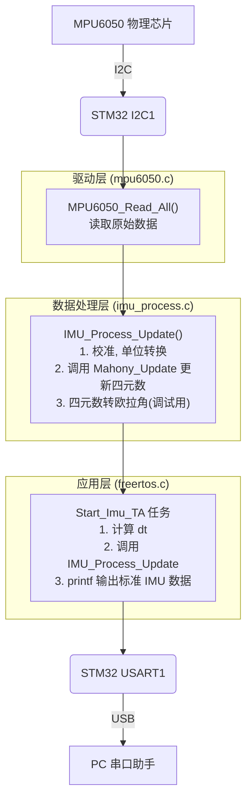

# MPU6050 项目文档 (V5.0 - Mahony AHRS)

本文档基于 `trae.md` 中的开发日志自动生成，旨在对当前项目状态进行全面总结。

## 1. 接口文档

### 1.1 文件结构与职责

| 文件路径 | 核心职责 |
| :--- | :--- |
| `App/Inc/mpu6050.h` | **MPU6050 驱动头文件**。定义硬件层接口，负责与芯片进行 I2C 通信。 |
| `App/Src/mpu6050.c` | **MPU6050 驱动实现文件**。实现 `MPU6050_Init` 和 `MPU6050_Read_All`，直接操作硬件。 |
| `App/Inc/imu_process.h` | **IMU 数据处理头文件**。定义了以**四元数**为核心的数据结构 `IMU_Data_t`, `IMU_Output_t` 和处理函数接口。 |
| `App/Src/imu_process.c` | **IMU 数据处理实现文件**。**项目的算法核心**。实现了 `Mahony_Update` 算法，负责将传感器数据融合成四元数姿态。 |
| `Core/Src/main.c` | **主程序入口**。负责 MCU 和外设初始化、FreeRTOS 启动、`printf` 重定向。 |
| `Core/Src/freertos.c` | **FreeRTOS 任务定义与实现**。`Imu_TA` 任务负责调用 `IMU_Process_Update`，并消费（打印）最终的四元数和欧拉角数据。 |

### 1.2 函数接口 (API)

#### `imu_process.h`

*   `void IMU_Process_Init(I2C_HandleTypeDef *hi2c, IMU_Data_t *data)`
    *   **功能**: 初始化 IMU 并进行静态校准，同时**初始化姿态四元数**。
    *   **参数**:
        *   `I2C_HandleTypeDef *hi2c`: I2C 句柄。
        *   `IMU_Data_t *data`: 指向 IMU 数据结构，函数将对其内部的四元数 `q` 进行初始化 (`{1,0,0,0}`)。

*   `void IMU_Process_Update(I2C_HandleTypeDef *hi2c, IMU_Data_t *data, IMU_Output_t *output, float dt)`
    *   **功能**: 核心函数。获取最新传感器数据，调用 Mahony AHRS 算法更新四元数，并填充所有输出数据。
    *   **执行流程**:
        1.  读取并校准传感器数据。
        2.  将加速度(g)和角速度(rad/s)传入 `Mahony_Update` 函数。
        3.  `Mahony_Update` 更新 `data->q` 四元数。
        4.  根据最新的 `data->q` 计算出调试用的欧拉角。
        5.  执行坐标系变换。
        6.  填充 `output` 结构体，包括 `linear_acceleration`, `angular_velocity`, 和核心的 `orientation` 四元数。
    *   **参数**:
        *   `I2C_HandleTypeDef *hi2c`: I2C 句柄。
        *   `IMU_Data_t *data`: 指向用于存储内部状态（包括四元数）的数据结构。
        *   `IMU_Output_t *output`: 指向用于存储标准化输出的数据结构。
        *   `float dt`: 时间间隔（秒）。

### 1.3 关键变量

| 变量名 | 定义位置 | 类型 | 作用 |
| :--- | :--- | :--- | :--- |
| `twoKp`, `twoKi` | `imu_process.c` | `static volatile float` | Mahony AHRS 算法的比例和积分增益，`volatile` 关键字允许在运行时进行在线调试和调整。 |
| `q` | `imu_process.h` (在 `IMU_Data_t` 中) | `float[4]` | **核心状态变量**。存储当前姿态的四元数 (`w, x, y, z`)。 |
| `orientation` | `imu_process.h` (在 `IMU_Output_t` 中) | `float[4]` | **核心输出变量**。用于向外部（如 ROS）提供标准化的四元数姿态。 |
| `imu_data` | `freertos.c` | `IMU_Data_t` | `Imu_TA` 任务中的实例，作为 `IMU_Process` 系列函数的输入和内部状态存储。 |

## 2. 技术、方法与算式

### 2.1 使用的技术

*   **FreeRTOS**: 用于多任务管理，保证 IMU 数据处理的实时性。
*   **I2C 通信**: 用于 STM32 与 MPU6050 传感器之间的数据传输。
*   **`printf` 重定向**: 用于调试输出。
*   **CMake 构建系统**: 用于管理项目编译。

### 2.2 核心算法与方法

*   **零偏校准**: 方法不变，系统启动时静态采集数据计算零偏。

*   **单位转换**: 方法不变，原始数据减去零偏后，除以灵敏度得到物理单位。

*   **动态 `dt` 计算**: 方法不变，在 FreeRTOS 任务中通过系统 tick 计算。

*   **姿态解算 (Mahony AHRS)**:
    *   **方法**: 一种高效的 IMU 和 MARG 姿态航向参考系统。它通过一个 PI 控制器来校正陀螺仪的积分误差。
    *   **步骤**:
        1.  **标准化加速度**: 将加速度测量值转换为单位向量。
        2.  **计算重力向量估计**: 根据当前的姿态四元数，计算出在传感器坐标系下，理论上的重力向量应该是怎样的。
        3.  **计算误差**: 将实际测量到的加速度向量（步骤1）与理论上的重力向量（步骤2）做叉积，得到一个误差向量。这个误差向量代表了当前姿态估计与“绝对”参考（重力）之间的偏差。
        4.  **PI 控制器校正**:
            *   **比例项 (Kp)**: 将误差向量直接乘以比例增益 `twoKp`，加到陀螺仪的读数上，进行快速校正。
            *   **积分项 (Ki)**: 将误差向量随时间积分，乘以积分增益 `twoKi`，加到陀螺仪的读数上，用于消除静态误差。
        5.  **陀螺仪积分**: 用经过校正后的陀螺仪数据，对四元数进行积分，得到新的姿态。
        6.  **四元数标准化**: 将更新后的四元数重新标准化，防止计算过程中累积误差导致其模长不为 1。
    *   **航向角 (Yaw)**:
        *   **方法**: 在没有磁力计的情况下，Yaw 角仍然主要依赖 Z 轴陀螺仪的积分。Mahony 算法本身无法凭空创造一个绝对的航向参考。
        *   **结果**: Yaw 角会漂移。

## 3. 数据流梳理

**目标**: 将 MPU6050 的物理信号，通过 Mahony AHRS 算法，转换为标准的四元数姿态输出。

**详细步骤**:

1.  **任务调度**: `Start_Imu_TA` 任务被唤醒，并计算出精确的时间间隔 `dt`。
2.  **数据更新请求**: `Start_Imu_TA` 调用 `IMU_Process_Update` 函数。
3.  **数据处理**: `IMU_Process_Update` 内部获取并校准传感器数据，然后将其喂给 `Mahony_Update` 算法。
4.  **姿态更新**: `Mahony_Update` 算法融合加速度计和陀螺仪数据，更新存储在 `IMU_Data_t` 结构体中的姿态四元数 `q`。
5.  **数据回填**: `IMU_Process_Update` 将更新后的四元数、经过坐标变换的传感器数据等，填充到 `IMU_Output_t` 结构体中。
6.  **格式化输出**: `Start_Imu_TA` 任务从 `IMU_Output_t` 中提取**四元数、线加速度、角速度**等数据，并通过 `printf` 格式化为 13 个字段的字符串打印到串口，用于调试和验证。

## 4. 当前状态能做到什么

根据 `trae.md` 的最终阶段总结，当前系统已经能够：

1.  **输出工业级姿态**: 成功解算出稳定、实时的姿态四元数，避免了欧拉角法的万向节死锁问题。
2.  **ROS 兼容**: 输出的 `orientation` 四元数和 `linear_acceleration`, `angular_velocity` 数据格式完全符合 ROS `sensor_msgs/Imu` 消息标准，可直接发布。
3.  **工程可用**: 输出的数据质量达到了工程可用的标准，可以用于机器人导航、定位和控制。
4.  **航向角输出**: 能够输出一个基于陀螺仪积分的航向角（Yaw），但存在漂移。

### 4.5 数据验证与分析

根据近期 (`260409-01`) 的调试，我们对输出数据的有效性进行了验证。

*   **验证背景**: 用户观察到 `result.md` 中的数据 `99,0,0,5,3,0,981,0,0,0,-4,1,67`，并对其正确性提出疑问。
*   **验证方法**: 将该数据与 `freertos.c` 中 `Start_Imu_TA` 任务的 `printf` 输出格式进行逐一映射和分析。
*   **分析结论**:
    1.  **传感器类型澄清**: MPU6050 是一个 6 轴传感器（3 轴加速度计 + 3 轴陀螺仪），**不包含磁力计**。用户感受到的“磁力计和加速度计反了”的问题，实际上是对陀螺仪数据的误解。
    2.  **数据正确性确认**:
        *   数据流中的第 7 个值 `981` 对应 `imu_output.linear_acceleration[2]`（Z 轴线加速度），乘以 100 后的结果。换算回物理单位为 `9.81 m/s²`，这与标准重力加速度（1g）完全一致。这表明**加速度计工作正常，且坐标系已正确对齐**（Z 轴朝上）。
        *   其余线加速度和角速度值均接近 0，符合设备在测试时处于**静态**的预期。
    3.  **输出格式标准化**: 当前的 13 个字段输出（4个四元数, 3个线加速度, 3个角速度, 3个欧拉角）是为了对齐 `sensor_msgs/Imu` 消息格式，并附加调试信息，是标准化过程的正确实践。

*   **总结**: 当前代码输出的数据**完全正常**，并且准确反映了传感器的物理状态。

## 5. 现存有什么问题

当前系统最主要的问题是：

*   **航向角 (Yaw) 漂移**: 由于仅使用加速度计和陀螺仪（6轴），无法修正航向角的积分误差，导致 Yaw 角会随着时间慢慢漂移。这是 6 轴 IMU 的固有局限性。
*   **解决方法**: 要解决此问题，需要引入一个绝对的方向参考，通常是**磁力计**。通过融合磁力计数据（如使用完整的 9 轴 Mahony AHRS 算法），才能获得一个长期稳定的、无漂移的航向角。
    *   已经购买了磁力计 `ak09911c`，这是下一步的工作。
*   **坐标系变换硬编码**: `imu_process.c` 中的坐标系变换是根据特定安装方式硬编码的。
*   **增益参数固定**: `twoKp` 和 `twoKi` 目前是固定的宏定义，未提供运行时调整的接口。
*   **串口输出占用资源**: 在 FreeRTOS 任务中高频使用 `printf` 会占用大量 CPU 时间，在最终产品中应使用更高效的通信方式。