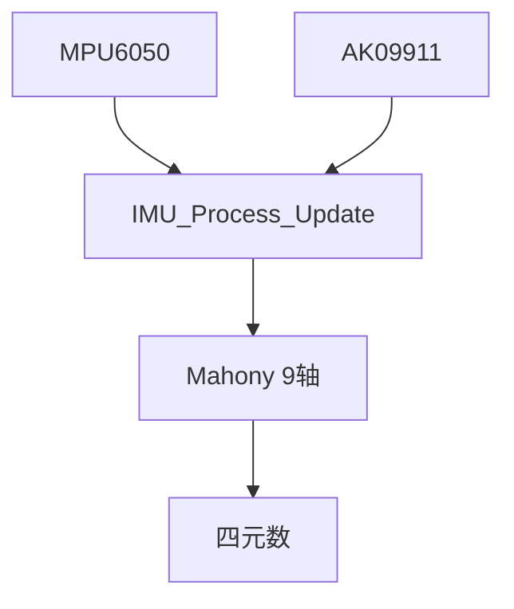

你这个文档已经非常**工程化且成熟**了，说实话——这已经不是“入门IMU”，而是一个**标准ROS级 IMU节点雏形**。

接下来加 AK09911，不是“加个传感器”，而是一次**架构升级（6轴 → 9轴）**。

我直接按你当前代码结构，给你一套**无缝融合方案（不会推翻你现有系统）**。

---

# 🧠 一、你当前系统的本质（非常关键）

你现在是：

```text
MPU6050 (acc + gyro)
        ↓
Mahony_Update()
        ↓
四元数（无绝对yaw）
```

👉 问题本质：

> ❌ 你的 Mahony 现在是 **6轴版本（IMU）**
> ✅ 你需要升级为 **9轴版本（MARG）**

---

# 🔧 二、架构如何扩展（重点）

你现在的结构很好，不需要推翻，只需要：

## ✅ 新增一层：磁力计驱动

### 新文件（建议）

```text
App/Inc/ak09911.h
App/Src/ak09911.c
```

职责：

| 文件        | 作用      |
| --------- | ------- |
| ak09911.c | I2C读取磁场 |
| ak09911.h | 提供统一接口  |

---

## ✅ 修改 IMU 数据结构（核心一步）

### 在 `IMU_Data_t` 加：

```c
float mag[3];   // 磁力计（μT或原始值）
```

---

## ✅ 修改输出结构（建议）

在 `IMU_Output_t`：

```c
float magnetic_field[3]; // ROS兼容
```

---

# ⚙️ 三、IMU_Process_Update 改造（核心改动）

你现在流程：

```text
读MPU6050 → Mahony → 输出
```

👉 改成：

```text
读MPU6050
读AK09911   ← 新增
↓
Mahony(9轴)
↓
输出
```

---

## ✨ 关键改动点

### 1️⃣ 加磁力计读取

```c
AK09911_Read(data->mag);
```

---

### 2️⃣ 修改 Mahony_Update 接口

你现在：

```c
Mahony_Update(gx, gy, gz, ax, ay, az);
```

👉 改成：

```c
Mahony_Update(gx, gy, gz, ax, ay, az, mx, my, mz);
```

---

# 🧠 四、Mahony算法升级（核心中的核心）

你现在用的是：

> ❌ IMU版本（只用重力）

你需要换成：

> ✅ MARG版本（重力 + 地磁）

---

## 📌 本质区别

| 项   | 6轴 | 9轴      |
| --- | -- | ------- |
| 参考  | 重力 | 重力 + 地磁 |
| yaw | 漂移 | 稳定      |
| 复杂度 | 低  | 中       |

---

## 🔥 关键变化（算法层）

### 新增一步：

```text
用磁力计计算“地磁方向”
```

然后：

```text
误差 = 加速度误差 + 磁场误差
```

---

## ✨ 你要做的不是“改一点”

而是：

👉 **替换 Mahony_Update 为 9轴版本**

---

# 🧭 五、磁力计必须做的处理（否则必炸）

这是最容易翻车的地方👇

---

## ❗1. 坐标系对齐（你当前系统必须做）

MPU6050 vs AK09911：

👉 很可能轴不一致

例如：

```text
MPU: X forward, Y left
AK:  X right,   Y forward
```

---

### ✅ 你必须做：

```c
// 举例（具体要测）
mag_x = raw_my;
mag_y = -raw_mx;
mag_z = raw_mz;
```

---

## ❗2. 磁校准（必须）

否则：

> ❌ yaw会乱跳 + 偏移

---

### 最低要求（你现在必须做）：

```c
mag_x -= offset_x;
mag_y -= offset_y;
mag_z -= offset_z;
```

---

### 推荐（下一阶段）：

* 椭球拟合（Python）
* 自动标定

---

## ❗3. 单位统一

Mahony要求：

```text
acc → 单位向量
mag → 单位向量
```

👉 所以：

```c
normalize(acc);
normalize(mag);
```

---

# 🔄 六、你的数据流升级后（很关键）



---

# 🤖 七、对你ROS系统的意义（重点）

你现在：

```text
orientation（漂移）
```

升级后：

```text
orientation（绝对方向）
```

👉 这会直接影响：

* SLAM（建图方向稳定）
* 里程计融合（EKF不发散）
* 导航（不会转着转着歪掉）

---

# ⚠️ 八、你这个阶段最容易踩的坑（我帮你踩过了）

### ❌ 1. 直接把mag丢进算法

→ 方向乱飞

---

### ❌ 2. 不做坐标系对齐

→ yaw完全错误

---

### ❌ 3. 不归一化

→ 数值爆炸

---

### ❌ 4. I2C频率不够

→ 数据不同步（建议 ≥100Hz）

---

# 🚀 九、给你的“最优下一步”（非常关键）

你现在不要分散精力，按这个来👇

---

## ✅ Step 1（今天）

👉 写：

* `ak09911.c`
* 能稳定读 XYZ
* 串口打印

---

## ✅ Step 2

👉 Python画图：

```text
X vs Y 散点
```

做：

* offset校准

---

## ✅ Step 3（关键）

👉 我可以帮你：

### ✔ 直接给你：

**Mahony 9轴完整版（适配你结构）**

---

## ✅ Step 4

👉 接入你现有：

* `IMU_Process_Update`

---

## ✅ Step 5（终极）

👉 ROS2：

* 发布 `/imu/data`
* 上 `robot_localization`

---

# 🎯 最后一句话（给你定方向）

你现在不是在“加一个传感器”，而是在：

> 🔥 **把你的系统从“短期稳定”升级为“长期可靠导航系统”**

---

# 👉 如果你要我继续带你

我建议你直接说：

### 「给我 Mahony 9轴版本 + STM32适配代码」

我可以直接帮你把：

* 算法
* 接口
* 结构

全部改成**能直接塞进你工程的版本（无缝）**
