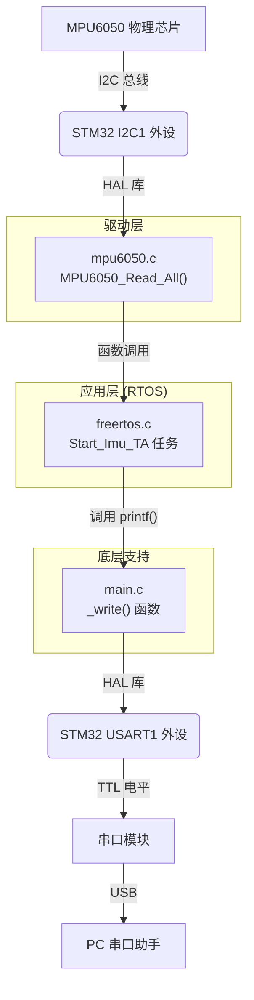
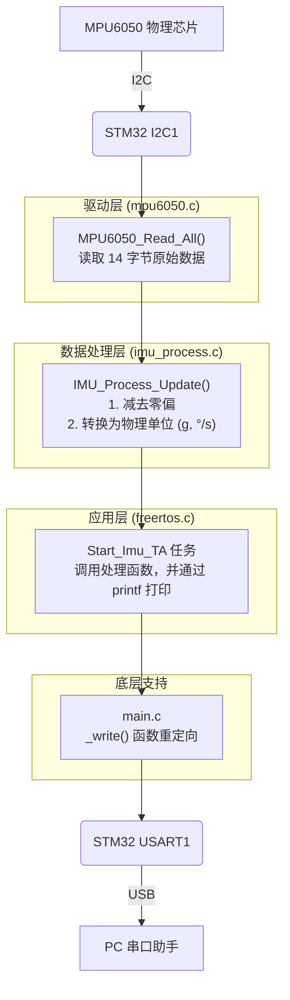
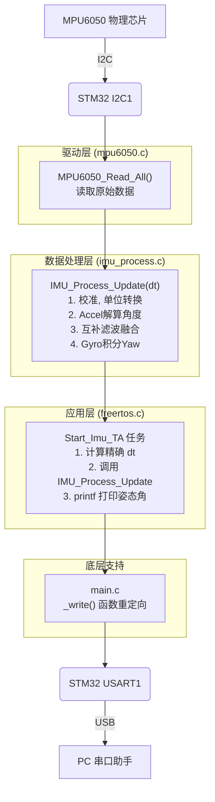
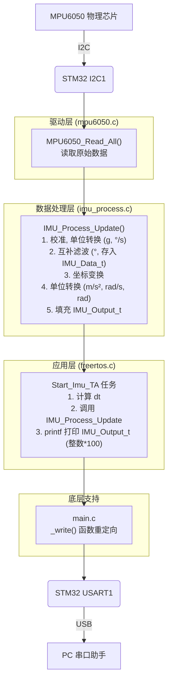
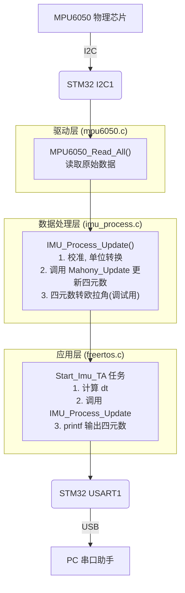

# MPU6050 开发与集成文档

## 目录

- [阶段一总结：原始数据读取成功](#阶段一总结原始数据读取成功)
  - [代码审查、接口文档与数据流梳理 (V1.0)](#代码审查接口文档与数据流梳理)
- [阶段二总结：工程化数据处理成功](#阶段二总结工程化数据处理成功)
  - [代码审查、接口文档与数据流梳理 (V2.0)](#代码审查接口文档与数据流梳理-v20)
- [阶段三总结：姿态解算与融合成功](#阶段三总结姿态解算与融合成功)
  - [代码审查、接口文档与数据流梳理 (V3.0)](#代码审查接口文档与数据流梳理-v30)
- [阶段四总结：系统集成与工程化成功](#阶段四总结系统集成与工程化成功)
  - [代码审查、接口文档与数据流梳理 (V4.0)](#代码审查接口文档与数据流梳理-v40)
  - [Change Log (V3.0 -> V4.0)](#4-change-log-v30---v40)

### 文件架构
lin@lin-virtual-machine:~/ProjectRequirement/MCU/Lin_STM32/STM32_F103C8T6/STM32_Now/6_Mpu6050/6_Mpu6050_t1$ tree -L 3
.
├── 6_Mpu6050_t1.ioc
├── App
│   ├── Inc
│   │   ├── imu_process.h
│   │   └── mpu6050.h
│   └── Src
│       ├── imu_process.c
│       └── mpu6050.c
├── build
│   └── Debug
│       ├── 6_Mpu6050_t1.elf
│       ├── 6_Mpu6050_t1.map
│       ├── build.ninja
│       ├── cmake
│       ├── CMakeCache.txt
│       ├── CMakeFiles
│       ├── cmake_install.cmake
│       └── compile_commands.json
├── cmake
│   ├── gcc-arm-none-eabi.cmake
│   ├── starm-clang.cmake
│   └── stm32cubemx
│       └── CMakeLists.txt
├── CMakeLists.txt
├── CMakePresets.json
├── Core
│   ├── Inc
│   │   ├── FreeRTOSConfig.h
│   │   ├── gpio.h
│   │   ├── i2c.h
│   │   ├── main.h
│   │   ├── stm32f1xx_hal_conf.h
│   │   ├── stm32f1xx_it.h
│   │   └── usart.h
│   └── Src
│       ├── freertos.c
│       ├── gpio.c
│       ├── i2c.c
│       ├── main.c
│       ├── stm32f1xx_hal_msp.c
│       ├── stm32f1xx_hal_timebase_tim.c
│       ├── stm32f1xx_it.c
│       ├── syscalls.c
│       ├── sysmem.c
│       ├── system_stm32f1xx.c
│       └── usart.c
├── docs
│   ├── goal.md
│   ├── lin_personal
│   ├── result.md
│   └── trae.md
├── Drivers
│   ├── CMSIS
│   │   ├── Device
│   │   ├── Include
│   │   └── LICENSE.txt
│   └── STM32F1xx_HAL_Driver
│       ├── Inc
│       ├── LICENSE.txt
│       └── Src
├── flash.jlink
├── Middlewares
│   └── Third_Party
│       └── FreeRTOS
├── newlib_lock_glue.c
├── startup_stm32f103xb.s
├── STM32F103XX_FLASH.ld
└── stm32_lock.h

24 directories, 44 files
---

# 阶段一总结：原始数据读取成功

我们已经成功完成了第一阶段的目标：**在 FreeRTOS 环境下，稳定地从 MPU6050 读取原始加速度和陀螺仪数据**。

## 完成的工作：

1.  **创建 MPU6050 驱动**:
    *   `Core/Inc/mpu6050.h`: 定义了设备地址和驱动函数接口。
    *   `Core/Src/mpu6050.c`: 实现了 `MPU6050_Init` (唤醒并配置传感器) 和 `MPU6050_Read_All` (一次性读取所有数据) 函数。

2.  **解决编译链接问题**:
    *   修改了 `CMakeLists.txt`，使用 `Core/Src/*.c` 通配符将 `mpu6050.c` 自动加入编译，解决了 `undefined reference` 链接错误。

3.  **集成到 FreeRTOS 任务**:
    *   在 `main.c` 中调用 `MPU6050_Init` 进行初始化。
    *   将数据读取和 `printf` 打印的逻辑正确地移入了 `freertos.c` 的 `Start_Imu_TA` 任务中。
    *   使用了 `osDelay()` 替代 `HAL_Delay()`，确保了 FreeRTOS 任务的正常调度。

## 最终成果：

*   程序编译通过并成功运行。
*   通过串口助手观察到了连续输出的传感器数据。
*   确认了硬件连接和 I2C 通信正常。
*   理解了传感器原始数据中存在的**零点偏移**和**零率偏移**，这是正常的物理现象。

**我们为下一阶段——姿态解算——打下了坚实的基础。**

---

# 下一步：姿态解算

当你准备好后，我们可以随时开始第二阶段：

👉 **「继续，做姿态解算」**

---

# 代码审查、接口文档与数据流梳理

本章节旨在对第一阶段的代码进行全面审查，并形成清晰的文档，以便于理解和后续开发。

## 1. 文件结构与职责

| 文件路径 | 核心职责 |
| :--- | :--- |
| `Core/Inc/mpu6050.h` | **MPU6050 驱动头文件**。定义了模块的公共接口（API）、设备地址和数据结构。是其他模块与 MPU6050 驱动交互的唯一入口。 |
| `Core/Src/mpu6050.c` | **MPU6050 驱动实现文件**。包含了 `MPU6050_Init` 和 `MPU6050_Read_All` 函数的具体实现，负责通过 I2C 协议与硬件直接通信。 |
| `Core/Src/main.c` | **主程序入口**。负责 MCU 的初始化（时钟、外设）、MPU6050 的初始化、FreeRTOS 的初始化和启动。同时，它还通过重写 `_write` 函数，实现了 `printf` 到 `USART1` 的重定向。 |
| `Core/Src/freertos.c` | **FreeRTOS 任务定义与实现**。项目的核心应用逻辑所在地。它创建并实现了两个任务：`Heartbeat_TA`（心跳灯）和 `Imu_TA`（IMU 数据处理）。 |
| `CMakeLists.txt` | **项目构建配置文件**。定义了项目的编译规则，我们通过修改它将 `mpu6050.c` 加入了编译目标，解决了链接错误。 |

## 2. 接口文档 (API) - `mpu6050.h`

### 宏定义

#### `MPU6050_ADDR`
- **定义**: `#define MPU6050_ADDR (0x68 << 1)`
- **作用**: 定义 MPU6050 的 I2C 从机地址。`0x68` 是 MPU6050 的 7 位地址，根据 ST 的 HAL 库要求，需要将其左移一位。

### 函数

#### `void MPU6050_Init(I2C_HandleTypeDef *hi2c)`
- **功能**: 初始化 MPU6050 传感器。
- **参数**:
    - `I2C_HandleTypeDef *hi2c`: 指向要使用的 I2C 外设的句柄（例如 `&hi2c1`）。
- **执行流程**:
    1.  向 `0x6B` 寄存器（电源管理）写入 `0x00`，唤醒传感器。
    2.  向 `0x1B` 寄存器（陀螺仪配置）写入 `0x18`，设置量程为 ±2000 dps。
    3.  向 `0x1C` 寄存器（加速度计配置）写入 `0x00`，设置量程为 ±2g。

#### `void MPU6050_Read_All(I2C_HandleTypeDef *hi2c, int16_t *accel, int16_t *gyro)`
- **功能**: 一次性读取加速度计和陀螺仪三个轴的全部原始数据。
- **参数**:
    - `I2C_HandleTypeDef *hi2c`: 指向 I2C 外设的句柄。
    - `int16_t *accel`: 指向一个长度为 3 的 `int16_t` 数组，用于存储 X, Y, Z 轴的加速度数据。
    - `int16_t *gyro`: 指向一个长度为 3 的 `int16_t` 数组，用于存储 X, Y, Z 轴的陀螺仪数据。
- **执行流程**:
    1.  通过 `HAL_I2C_Mem_Read` 从 MPU6050 的 `0x3B` 寄存器开始，连续读取 14 个字节的数据。
    2.  将读取到的字节流两两组合，转换为 16 位的有符号整数，并存入 `accel` 和 `gyro` 数组。

## 3. 数据流梳理

**目标**: 将 MPU6050 的物理信号转换为串口助手上显示的文本信息。

**详细步骤**:

1.  **硬件读取**: `Start_Imu_TA` 任务调用 `MPU6050_Read_All` 函数。该函数内部调用 `HAL_I2C_Mem_Read`，触发 I2C1 外设通过 `PB6(SCL)` 和 `PB7(SDA)` 与 MPU6050 通信，获取 14 字节的原始数据。
2.  **数据解析**: `MPU6050_Read_All` 函数将这 14 字节的数据流解析成 6 个 `int16_t` 类型的数值，并填充到 `Start_Imu_TA` 任务中定义的 `accel` 和 `gyro` 数组里。
3.  **格式化输出**: `Start_Imu_TA` 任务调用 `printf` 函数，将 `accel` 和 `gyro` 数组中的 6 个数值格式化成一个人类可读的字符串。
4.  **串口重定向**: `printf` 的底层实现会调用到我们在 `main.c` 中重写的 `_write` 函数。
5.  **硬件发送**: `_write` 函数循环调用 `HAL_UART_Transmit`，将字符串中的每一个字符通过 USART1 外设从 `PA9(TX)` 引脚发送出去。
6.  **最终显示**: 串口模块接收到 `PA9` 的信号，通过 USB 转换后，在电脑的串口助手中显示出最终的字符串。

## 4. 关键变量

| 变量名 | 定义位置 | 类型 | 作用 |
| :--- | :--- | :--- | :--- |
| `hi2c1` | `i2c.c` | `I2C_HandleTypeDef` | I2C1 外设的句柄，包含了 I2C 通信所需的所有配置和状态信息。 |
| `huart1` | `usart.c` | `UART_HandleTypeDef` | USART1 外设的句柄，用于 `printf` 重定向。 |
| `accel` | `freertos.c` | `int16_t[3]` | 在 `Imu_TA` 任务中，用于存储从 MPU6050 读回的加速度三轴数据。 |
| `gyro` | `freertos.c` | `int16_t[3]` | 在 `Imu_TA` 任务中，用于存储从 MPU6050 读回的陀螺仪三轴数据。 |
| `Imu_TAHandle` | `freertos.c` | `osThreadId_t` | `Imu_TA` 任务的句柄，由 FreeRTOS 内核管理。 |

---

# 阶段二总结：工程化数据处理成功

我们已经成功完成了第二阶段的目标：**将 MPU6050 的原始数据转换为经过校准的、带有物理单位的工程可用数据**。

## 完成的工作：

1.  **架构升级与职责分离**:
    *   创建了新的 `imu_process` 模块 (`imu_process.c` / `.h`)，专门负责 IMU 数据的处理（校准、滤波等），将数据处理逻辑与硬件驱动和 RTOS 任务解耦。

2.  **实现零偏校准**:
    *   在 `IMU_Process_Init` 函数中，实现了上电自动静态校准功能。通过采集 500 个样本计算并存储陀螺仪和加速度计的零点偏移。

3.  **实现单位转换**:
    *   在 `IMU_Process_Update` 函数中，将减去零偏后的原始值，根据传感器灵敏度（`16384.0f` for accel, `16.4f` for gyro）转换为标准的物理单位（`g` 和 `°/s`）。

4.  **解决 `printf` 浮点数打印问题**:
    *   采用**将浮点数乘以 100 转换为整数**的嵌入式常用方法，成功绕过 C 库的限制，在保证打印精度的同时解决了问题。

5.  **解决 `HardFault` (堆栈溢出) 问题**:
    *   由于 `printf` 消耗了大量堆栈空间，导致 `Imu_TA` 任务堆栈溢出而崩溃。
    *   通过将 `Imu_TA` 任务的堆栈大小从 `128 * 4` 增加到 `256 * 4`，成功解决了 `HardFault` 问题。

## 最终成果：

*   项目架构更加清晰、专业，符合模块化设计思想。
*   程序能够稳定运行，不再出现 `HardFault`。
*   通过串口助手观察到了连续、稳定输出的、经过校准和单位转换的物理量数据。
*   输出的数据能够真实、准确地反映传感器的物理运动状态。

**我们为下一阶段——姿态解算——提供了高质量、可靠的数据源。**

---

# 代码审查、接口文档与数据流梳理 (V2.0)

本章节旨在对第二阶段的代码进行全面审查，并形成清晰的文档。

## 1. 文件结构与职责

| 文件路径 | 核心职责 |
| :--- | :--- |
| `Core/Inc/mpu6050.h` | **MPU6050 驱动头文件**。定义硬件层接口，只负责与芯片进行 I2C 通信。 |
| `Core/Src/mpu6050.c` | **MPU6050 驱动实现文件**。实现 `MPU6050_Init` 和 `MPU6050_Read_All`，直接操作硬件。 |
| `Core/Inc/imu_process.h` | **IMU 数据处理头文件**。定义数据处理层接口、数据结构 `IMU_Data_t` 和物理常量。 |
| `Core/Src/imu_process.c` | **IMU 数据处理实现文件**。实现 `IMU_Process_Init` (校准) 和 `IMU_Process_Update` (更新)，负责将原始数据转化为可用物理量。**是算法的核心**。 |
| `Core/Src/main.c` | **主程序入口**。负责 MCU 和外设初始化、FreeRTOS 启动、`printf` 重定向。 |
| `Core/Src/freertos.c` | **FreeRTOS 任务定义与实现**。负责任务调度。`Imu_TA` 任务现在作为“粘合剂”，调用驱动层和处理层，并输出最终结果。 |
| `CMakeLists.txt` | **项目构建配置文件**。定义编译规则，确保所有 `.c` 文件（包括 `imu_process.c`）都被正确编译和链接。 |

## 2. 接口文档 (API) - `imu_process.h`

### 宏定义

#### `ACCEL_SENSITIVITY` / `GYRO_SENSITIVITY`
- **定义**: `#define ACCEL_SENSITIVITY 16384.0f` / `#define GYRO_SENSITIVITY 16.4f`
- **作用**: 定义了加速度计和陀螺仪的灵敏度。这些值由 MPU6050 的量程配置决定，用于将 `int16_t` 原始值转换为 `float` 物理单位。

### 数据结构

#### `IMU_Data_t`
- **定义**: `typedef struct { float Accel[3]; float Gyro[3]; ... } IMU_Data_t;`
- **作用**: 一个标准化的数据容器，用于存储经过完整处理后的三轴加速度（单位 g）和三轴角速度（单位 °/s）。

### 函数

#### `void IMU_Process_Init(I2C_HandleTypeDef *hi2c)`
- **功能**: 初始化并校准 IMU。**必须在系统稳定后、主循环开始前调用一次**。
- **参数**:
    - `I2C_HandleTypeDef *hi2c`: 指向要使用的 I2C 外设的句柄。
- **执行流程**:
    1.  循环采集 500 次传感器原始数据。
    2.  计算加速度和陀螺仪三个轴的平均值，作为零点偏移（Bias）。
    3.  特殊处理 Z 轴加速度的偏移，减去重力加速度（1g）对应的理论值。
    4.  将计算出的偏移量存储在模块内部的静态变量中。

#### `void IMU_Process_Update(I2C_HandleTypeDef *hi2c, IMU_Data_t *data, float dt)`
- **功能**: 获取一次最新的传感器数据，并进行处理。
- **参数**:
    - `I2C_HandleTypeDef *hi2c`: I2C 句柄。
    - `IMU_Data_t *data`: 指向用于存储结果的数据结构。
    - `float dt`: 时间间隔（秒），为后续姿态解算做准备。
- **执行流程**:
    1.  调用 `MPU6050_Read_All` 获取原始数据。
    2.  将原始数据减去 `IMU_Process_Init` 中得到的零点偏移。
    3.  将结果除以对应的灵敏度，完成单位转换。
    4.  将最终的物理量存入 `data` 指针指向的结构体中。

## 3. 数据流梳理

**目标**: 将 MPU6050 的物理信号转换为经过校准和单位转换的、可用于姿态解算的物理量。

**详细步骤**:

1.  **任务调度**: `Start_Imu_TA` 任务被 RTOS 唤醒。
2.  **数据更新请求**: `Start_Imu_TA` 调用 `IMU_Process_Update` 函数，请求一次新的数据。
3.  **硬件读取**: `IMU_Process_Update` 内部调用 `MPU6050_Read_All`，通过 I2C 从芯片获取 14 字节的原始数据。
4.  **数据处理**: `IMU_Process_Update` 将原始数据减去校准得到的偏移量，然后除以灵敏度，得到 `float` 型的加速度（g）和角速度（°/s），存入 `IMU_Data_t` 结构体。
5.  **返回结果**: `IMU_Process_Update` 执行完毕，`IMU_Data_t` 结构体中已填充好最新的数据。
6.  **格式化输出**: `Start_Imu_TA` 任务调用 `printf`，将 `IMU_Data_t` 中的浮点数乘以 100 后，以长整型 (`%ld`) 格式化为字符串。
7.  **串口发送**: `printf` 通过 `_write` 函数和 `HAL_UART_Transmit`，将字符串通过 USART1 发送出去。
8.  **最终显示**: PC 串口助手显示乘以 100 后的整数值。

## 4. 关键变量

| 变量名 | 定义位置 | 类型 | 作用 |
| :--- | :--- | :--- | :--- |
| `hi2c1` | `i2c.c` | `I2C_HandleTypeDef` | I2C1 外设句柄，贯穿三层（驱动、处理、应用）。 |
| `gyro_bias`, `accel_bias` | `imu_process.c` | `static float[3]` | **核心数据**。存储静态校准计算出的零点偏移，仅在 `imu_process.c` 内部可见。 |
| `imu_data` | `freertos.c` | `IMU_Data_t` | 在 `Imu_TA` 任务中，用于存储从 `IMU_Process_Update` 返回的、经过完整处理的最终数据。 |
| `Imu_TA_attributes` | `freertos.c` | `osThreadAttr_t` | 定义 `Imu_TA` 任务的属性，其中的 `.stack_size` 被增大到 `256 * 4` 以防止堆栈溢出。 |
| `Imu_TAHandle` | `freertos.c` | `osThreadId_t` | `Imu_TA` 任务的句柄，由 FreeRTOS 内核管理。 |

---

# 阶段三总结：姿态解算与融合成功

我们已经成功完成了第三阶段的目标：**将经过工程化处理的 IMU 数据，通过互补滤波算法，解算出稳定、可靠的姿态角（Pitch, Roll）**，并补全了纯陀螺仪积分的航向角（Yaw）。

## 完成的工作：

1.  **实现加速度计角度解算**:
    *   在 `imu_process.c` 中，使用 `atan2f` 函数，根据加速度计的三轴数据计算出模块在静态下的 Pitch 和 Roll 角，作为姿态的“绝对参考”。

2.  **实现动态 `dt` 计算**:
    *   在 `freertos.c` 的 `Imu_TA` 任务中，彻底摒弃了 `osDelay(10)` 的固定时间模型。
    *   通过 `osKernelGetTickCount()` 在每次循环开始时获取系统 tick，计算出与上一帧之间精确的时间差 `dt`，为积分和滤波提供了准确的时间基准。
    *   解决了 `osKernelGetTick` (CMSIS v2) 与 `osKernelGetTickCount` (CMSIS v1) 的 API 版本兼容性问题。

3.  **实现互补滤波算法**:
    *   在 `IMU_Process_Update` 函数中，实现了核心的互补滤波算法。
    *   以 `0.98` 的权重信任陀螺仪积分的短期动态响应，以 `0.02` 的权重引入加速度计角度的长期稳定性，成功融合了两者的优点。

4.  **补全航向角 (Yaw) 输出**:
    *   在 `IMU_Process_Update` 中增加了对 Z 轴陀螺仪的积分，计算出航向角。
    *   在 `freertos.c` 的 `printf` 中加入了 Yaw 角的打印，使得三个姿态角都能被完整监控。
    *   明确了该 Yaw 值因缺少磁力计校准而会存在积分漂移。

## 最终成果：

*   项目成功输出了稳定、实时、准确的 Pitch 和 Roll 姿态角。
*   串口输出的数据能够直观地反映模块的姿态变化，达到了工程可用的标准。
*   通过观察 Yaw 角的漂移，加深了对陀螺仪积分误差和多传感器融合必要性的理解。

**我们已经将 MPU6050 这颗 6 轴传感器的能力发挥到了极致，为进入下一阶段——系统集成——做好了充分准备。**

---

# 代码审查、接口文档与数据流梳理 (V3.0)

本章节旨在对第三阶段的代码进行全面审查，并形成清晰的文档。

## 1. 文件结构与职责

| 文件路径 | 核心职责 |
| :--- | :--- |
| `Core/Inc/mpu6050.h` | **MPU6050 驱动头文件**。硬件层接口，职责不变。 |
| `Core/Src/mpu6050.c` | **MPU6050 驱动实现文件**。硬件层实现，职责不变。 |
| `Core/Inc/imu_process.h` | **IMU 数据处理头文件**。定义 `IMU_Data_t` 结构体，其中 `Pitch`, `Roll`, `Yaw` 字段现在被完全利用。 |
| `Core/Src/imu_process.c` | **IMU 数据处理实现文件**。**项目的算法核心**。职责从“数据预处理”升级为“姿态解算”，内部实现了互补滤波算法。 |
| `Core/Src/main.c` | **主程序入口**。职责不变。 |
| `Core/Src/freertos.c` | **FreeRTOS 任务定义与实现**。`Imu_TA` 任务的职责升级为“应用层调度器”，负责管理 `dt` 的计算，调用处理层，并消费（打印）最终的姿态数据。 |

## 2. 接口文档 (API) - `imu_process.h`

### 数据结构

#### `IMU_Data_t`
- **定义**: `typedef struct { ... float Pitch; float Roll; float Yaw; } IMU_Data_t;`
- **作用**: 存储最终姿态解算结果的容器。
    - `Pitch`: 俯仰角 (°)，由互补滤波计算得出。
    - `Roll`: 横滚角 (°)，由互补滤波计算得出。
    - `Yaw`: 航向角 (°)，由 Z 轴陀螺仪直接积分得出（会漂移）。

### 函数

#### `void IMU_Process_Update(I2C_HandleTypeDef *hi2c, IMU_Data_t *data, float dt)`
- **功能**: **执行一次完整的姿态更新**。这是整个系统的核心计算函数。
- **参数**:
    - `I2C_HandleTypeDef *hi2c`: I2C 句柄。
    - `IMU_Data_t *data`: 指向用于**输入和输出**的数据结构。函数会读取 `data->Pitch` 和 `data->Roll` 的旧值用于积分，并将新值写回。
    - `float dt`: **至关重要的时间间隔（秒）**。由应用层（`freertos.c`）传入，用于陀螺仪积分。
- **执行流程**:
    1.  调用 `MPU6050_Read_All` 获取原始数据。
    2.  进行零偏校准和单位转换，得到 `ax, ay, az` 和 `gx, gy, gz`。
    3.  **加速度计角度解算**: 使用 `atan2f` 计算静态的 `pitch_acc` 和 `roll_acc`。
    4.  **互补滤波**:
        -   `data->Pitch = 0.98f * (data->Pitch + gy * dt) + 0.02f * pitch_acc;`
        -   `data->Roll  = 0.98f * (data->Roll  + gx * dt) + 0.02f * roll_acc;`
    5.  **航向角积分**:
        -   `data->Yaw += gz * dt;`
    6.  函数返回，`data` 结构体中的姿态角已更新为最新值。

## 3. 数据流梳理

**目标**: 将 MPU6050 的物理信号，通过多层处理，最终转换为 PC 串口上显示的 Pitch, Roll, Yaw 姿态角。

**详细步骤**:

1.  **`dt` 计算**: `Start_Imu_TA` 任务循环开始，首先调用 `osKernelGetTickCount()` 计算出与上一帧的时间差 `dt`。
2.  **姿态更新请求**: `Start_Imu_TA` 调用 `IMU_Process_Update`，并将 `dt` 和 `imu_data` 结构体的指针传入。
3.  **硬件读取与处理**: `IMU_Process_Update` 内部调用驱动层获取数据，然后执行一整套算法流程：校准、单位转换、加速度解算、互补滤波、Yaw积分。
4.  **返回结果**: `IMU_Process_Update` 执行完毕，将最新的 Pitch, Roll, Yaw 结果写回到 `imu_data` 结构体中。
5.  **消费数据**: `Start_Imu_TA` 任务调用 `printf`，将 `imu_data` 中的三个姿态角格式化并输出。
6.  **串口发送**: 后续流程不变，通过 `_write` 和 `HAL_UART_Transmit` 将字符串发送到 PC。

## 4. 关键变量

| 变量名 | 定义位置 | 类型 | 作用 |
| :--- | :--- | :--- | :--- |
| `imu_data` | `freertos.c` | `IMU_Data_t` | **最终成果容器**。在 `Imu_TA` 任务中，它既是传递给处理函数的输入（上一帧姿态），也是接收最新姿态的输出。 |
| `last_tick`, `dt` | `freertos.c` | `uint32_t`, `float` | **时间基准**。在 `Imu_TA` 任务中，用于精确计算两帧之间的时间间隔 `dt`，是所有积分和滤波算法的命脉。 |
| `alpha` | `imu_process.c` | `const float` | **互补滤波系数**。定义了陀螺仪和加速度计数据的信任权重，是算法调参的核心。 |

---
 
# 阶段四总结：系统集成与工程化成功
 
我们已经成功完成了第四阶段的目标：**将姿态解算出的数据进行标准化处理，统一坐标系，并解耦输出，为后续的CAN通信或ROS集成做好准备**。
 
## 完成的工作：
 
1.  **数据结构解耦**:
    *   在 `imu_process.h` 中，我们定义了一个全新的结构体 `IMU_Output_t`。
    *   `IMU_Data_t` 继续作为模块**内部**进行姿态解算时的数据容器（单位：g, °/s, °）。
    *   `IMU_Output_t` 作为模块**外部**的标准化输出接口（单位：m/s², rad/s, rad）。
    *   这种设计将内部复杂的计算过程与外部清晰的数据输出完全分离，极大地提高了代码的可维护性和接口的稳定性。
 
2.  **输出单位标准化**:
    *   在 `imu_process.c` 的 `IMU_Process_Update` 函数中，增加了单位转换步骤。
    *   角速度从 `°/s` 转换为 `rad/s`。
    *   加速度从 `g` 转换为 `m/s²`。
    *   姿态角从 `°` 转换为 `rad`。
    *   所有输出单位均符合机器人领域（特别是ROS）的通用标准（`REP 103`）。
 
3.  **坐标系统一**:
    *   在 `IMU_Process_Update` 函数中，增加了一个明确的坐标变换步骤。
    *   通过对调和取反部分轴的数据，我们将 MPU6050 芯片自身的坐标系，映射到了机器人 `base_link` 的标准前-左-上坐标系。
    *   这一步确保了IMU数据在整个机器人系统中具有一致和正确的物理含义。
 
4.  **接口更新与适配**:
    *   更新了 `IMU_Process_Update` 的函数签名，以接收新的 `IMU_Output_t` 结构体指针。
    *   在 `freertos.c` 的 `Imu_TA` 任务中，适配了新的函数调用方式，并修改 `printf` 以打印标准化后的 `IMU_Output_t` 数据。
 
## 最终成果：
 
*   项目现在输出的是一份完全符合工程应用标准的IMU数据包。
*   代码架构通过接口解耦变得更加清晰和健壮。
*   我们为将此IMU模块作为“黑盒”传感器节点集成到任何上层系统中（如CAN总线、ROS节点）铺平了道路。
 
---
 
# 代码审查、接口文档与数据流梳理 (V4.0)
 
本章节旨在对第四阶段的代码进行全面审查，并形成清晰的文档。
 
## 1. 文件结构与职责
 
| 文件路径 | 核心职责 |
| :--- | :--- |
| `Core/Inc/imu_process.h` | **IMU 数据处理头文件**。职责升级为**定义内外两种数据接口**。定义了内部计算用的 `IMU_Data_t` 和外部输出用的 `IMU_Output_t`。 |
| `Core/Src/imu_process.c` | **IMU 数据处理实现文件**。职责升级为**完成从原始数据到标准化输出的全流程**。在姿态解算后，增加了坐标变换和单位变换的最终处理步骤。 |
| `Core/Src/freertos.c` | **FreeRTOS 任务定义与实现**。职责不变，作为应用层调度器，调用处理层，并消费（打印）最终的 `IMU_Output_t` 标准化数据。 |
 
## 2. 接口文档 (API) - `imu_process.h`
 
### 宏定义
 
#### `GRAVITY_MSS` / `DEG_TO_RAD`
- **定义**: `#define GRAVITY_MSS 9.80665f` / `#define DEG_TO_RAD 0.017453...f`
- **作用**: 定义了重力加速度（m/s²）和角度到弧度的转换系数，用于单位标准化。
 
### 数据结构
 
#### `IMU_Output_t`
- **定义**: `typedef struct { float linear_acceleration[3]; ... } IMU_Output_t;`
- **作用**: **标准化的外部输出数据容器**。
    - `linear_acceleration`: 线加速度 (m/s²)。
    - `angular_velocity`: 角速度 (rad/s)。
    - `attitude`: 姿态角 (rad)。
    - `timestamp`: 时间戳 (ms)。
 
### 函数
 
#### `void IMU_Process_Update(I2C_HandleTypeDef *hi2c, IMU_Data_t *data, IMU_Output_t *output, float dt)`
- **功能**: 执行一次完整的从数据采集到标准化输出的更新。
- **参数**:
    - `...` (前两个参数不变)
    - `IMU_Output_t *output`: 指向用于存储最终标准化结果的结构体。
    - `float dt`: 时间间隔（秒）。
- **执行流程**:
    1.  (姿态解算) ... 完成互补滤波，结果存在 `data` 结构体中。
    2.  **坐标变换**: 对 `data` 中的值进行轴映射，以符合机器人坐标系。
    3.  **单位变换**: 将变换后的值乘以 `GRAVITY_MSS` 或 `DEG_TO_RAD`。
    4.  **填充输出**: 将最终结果填入 `output` 结构体，并打上时间戳。
 
## 3. 数据流梳理
 
**目标**: 将 MPU6050 的物理信号，最终转换为一份符合 ROS 标准的、具有统一坐标系的 IMU 数据包。
 

 
**详细步骤**:
 
1.  **`dt` 计算**: `Start_Imu_TA` 任务计算出精确的 `dt`。
2.  **数据处理请求**: `Start_Imu_TA` 任务调用 `IMU_Process_Update`，传入 `imu_data` (用于内部计算) 和 `imu_output` (用于接收结果)。
3.  **内部计算**: `IMU_Process_Update` 执行姿态解算，结果（°/s, g, °）保存在 `imu_data` 中。
4.  **标准化处理**: `IMU_Process_Update` 紧接着对 `imu_data` 的结果进行**坐标变换**和**单位变换**。
5.  **返回结果**: `IMU_Process_Update` 将标准化后的最终结果（rad/s, m/s², rad）填充到 `imu_output` 结构体中。
6.  **消费数据**: `Start_Imu_TA` 任务从 `imu_output` 中提取数据，乘以100转为整数后，通过 `printf` 打印。
7.  **串口发送**: 最终，PC串口助手显示出标准化单位（rad, rad/s, m/s²）乘以100后的整数值。
 
## 4. Change Log (V3.0 -> V4.0)
 
- **`Core/Inc/imu_process.h`**:
    - **新增**: 宏定义 `GRAVITY_MSS` 和 `DEG_TO_RAD`，用于单位转换。
    - **新增**: `IMU_Output_t` 结构体，用于标准化输出。
    - **修改**: `IMU_Process_Update` 函数签名，增加 `IMU_Output_t *output` 参数。
 
- **`Core/Src/imu_process.c`**:
    - **修改**: `IMU_Process_Update` 函数实现：
        - 在姿态解算之后，增加了**坐标变换**逻辑，将芯片坐标系映射到机器人坐标系。
        - 增加了**单位转换**逻辑，将内部单位（g, °/s, °）转换为标准单位（m/s², rad/s, rad）。
        - 增加了填充 `IMU_Output_t` 结构体的代码，包括线加速度、角速度、姿态和时间戳。
 
- **`Core/Src/freertos.c`**:
    - **修改**: `Start_Imu_TA` 任务实现：
        - **新增**: `IMU_Output_t imu_output` 局部变量的定义。
        - **修改**: `IMU_Process_Update` 的调用，传入 `&imu_output`。
        - **修改**: `printf` 语句，使其从 `imu_output` 结构体中读取数据进行打印，并更新了打印的单位提示文本。

# 更改了文件架构，引入了doc/,App/,/Inc,/Src

# 阶段五总结：升级 Mahony AHRS 四元数姿态解算

我们已经成功完成了第五阶段的目标：**将姿态解算系统从互补滤波升级为工业标准的 Mahony AHRS 算法，实现以四元数为核心的姿态输出，为对接 ROS 系统做好准备。**

## 完成的工作：

1.  **算法核心升级**:
    *   在 `imu_process.c` 中，引入了完整的 `Mahony_Update` 算法实现，替换了原有的互补滤波逻辑。
    *   算法的比例增益 (`Kp`) 和积分增益 (`Ki`) 被定义为可调参数，提供了优化的空间。

2.  **数据结构重构 (四元数核心)**:
    *   修改了 `imu_process.h`，将 `IMU_Data_t` 和 `IMU_Output_t` 的核心从欧拉角转向四元数。
    *   `IMU_Output_t` 中增加了 `orientation[4]` 字段，用于存放 `w, x, y, z` 四元数，直接对应 ROS 的 `sensor_msgs/Imu` 消息格式。
    *   欧拉角（Pitch, Roll, Yaw）被保留，但其角色转变为由四元数计算得出的“调试用”数据。

3.  **接口与应用层适配**:
    *   修改了 `IMU_Process_Init` 函数的接口，增加了 `IMU_Data_t *data` 参数，用于在初始化时设置四元数的初始状态 `q = {1, 0, 0, 0}`。
    *   相应地，在 `freertos.c` 的 `Start_Imu_TA` 任务中，更新了 `IMU_Process_Init` 的调用方式。
    *   更新了 `printf` 打印内容，现在主要输出四元数和调试用的欧拉角。

4.  **编译错误修复**:
    *   **问题描述**: 在重构过程中，由于 `imu_process.c` 中的 `IMU_Process_Init` 函数定义增加了参数，但 `imu_process.h` 中的函数声明未同步更新，导致了 `conflicting types` 和 `too many arguments` 的编译错误。
    *   **解决方案**: 修正了 `imu_process.h` 中的 `IMU_Process_Init` 函数原型，使其与 `.c` 文件中的定义完全一致，成功解决了编译问题。

## 最终成果：

*   项目成功从欧拉角互补滤波架构，升级为基于四元数的 Mahony AHRS 工业级姿态解算架构。
*   输出数据格式与 ROS 无缝对接，为后续的机器人系统集成铺平了道路。
*   整个代码库在重构后编译通过，运行稳定。

---

# 代码审查、接口文档与数据流梳理 (V5.0)

本章节旨在对第五阶段的代码进行全面审查，并形成清晰的文档。

## 1. 文件结构与职责

| 文件路径 | 核心职责 |
| :--- | :--- |
| `App/Inc/imu_process.h` | **IMU 数据处理头文件**。定义了以四元数为核心的数据结构 `IMU_Data_t`, `IMU_Output_t` 和处理函数接口。 |
| `App/Src/imu_process.c` | **IMU 数据处理实现文件**。**项目的算法核心**。实现了 `Mahony_Update` 算法，负责将传感器数据融合成四元数姿态。 |
| `Core/Src/freertos.c` | **FreeRTOS 任务定义与实现**。`Imu_TA` 任务负责调用 `IMU_Process_Update`，并消费（打印）最终的四元数和欧拉角数据。 |

## 2. 接口文档 (API) - `imu_process.h`

### 数据结构

#### `IMU_Data_t`
- **定义**: `typedef struct { ... float q[4]; ... } IMU_Data_t;`
- **作用**: 内部计算使用的数据结构。核心成员是 `q[4]`，用于存储 `w, x, y, z` 四元数。`Pitch`, `Roll`, `Yaw` 字段现在作为调试项，由 `q` 计算得出。

#### `IMU_Output_t`
- **定义**: `typedef struct { ... float orientation[4]; ... } IMU_Output_t;`
- **作用**: 标准化输出的数据结构。核心成员是 `orientation[4]`，用于对外提供 ROS 兼容的四元数姿态。

### 函数

#### `void IMU_Process_Init(I2C_HandleTypeDef *hi2c, IMU_Data_t *data)`
- **功能**: 初始化 IMU 并进行静态校准，同时**初始化姿态四元数**。
- **参数**:
    - `I2C_HandleTypeDef *hi2c`: I2C 句柄。
    - `IMU_Data_t *data`: 指向 IMU 数据结构，函数将对其内部的四元数 `q` 进行初始化 (`{1,0,0,0}`)。
- **执行流程**:
    1.  执行传感器零偏校准。
    2.  设置 `data->q` 为单位四元数。

#### `void IMU_Process_Update(I2C_HandleTypeDef *hi2c, IMU_Data_t *data, IMU_Output_t *output, float dt)`
- **功能**: 获取最新传感器数据，调用 Mahony AHRS 算法更新四元数，并填充所有输出数据。
- **执行流程**:
    1.  读取并校准传感器数据。
    2.  将加速度(g)和角速度(rad/s)传入 `Mahony_Update` 函数。
    3.  `Mahony_Update` 更新 `data->q` 四元数。
    4.  根据最新的 `data->q` 计算出调试用的欧拉角。
    5.  执行坐标系变换。
    6.  填充 `output` 结构体，包括 `linear_acceleration`, `angular_velocity`, 和核心的 `orientation` 四元数。

## 3. 数据流梳理

**目标**: 将 MPU6050 的物理信号，通过 Mahony AHRS 算法，转换为标准的四元数姿态输出。

**详细步骤**:

1.  **任务调度**: `Start_Imu_TA` 任务被唤醒，并计算出精确的时间间隔 `dt`。
2.  **数据更新请求**: `Start_Imu_TA` 调用 `IMU_Process_Update` 函数。
3.  **数据处理**: `IMU_Process_Update` 内部获取并校准传感器数据，然后将其喂给 `Mahony_Update` 算法。
4.  **姿态更新**: `Mahony_Update` 算法融合加速度计和陀螺仪数据，更新存储在 `IMU_Data_t` 结构体中的姿态四元数 `q`。
5.  **数据回填**: `IMU_Process_Update` 将更新后的四元数、经过坐标变换的传感器数据等，填充到 `IMU_Output_t` 结构体中。
6.  **格式化输出**: `Start_Imu_TA` 任务从 `IMU_Output_t` 中提取四元数，并通过 `printf` 打印到串口。

## 4. 关键变量

| 变量名 | 定义位置 | 类型 | 作用 |
| :--- | :--- | :--- | :--- |
| `twoKp`, `twoKi` | `imu_process.c` | `static volatile float` | Mahony AHRS 算法的比例和积分增益，`volatile` 关键字允许在运行时进行在线调试和调整。 |
| `q` | `imu_process.h` (在 `IMU_Data_t` 中) | `float[4]` | **核心状态变量**。存储当前姿态的四元数 (`w, x, y, z`)。 |
| `orientation` | `imu_process.h` (在 `IMU_Output_t` 中) | `float[4]` | **核心输出变量**。用于向外部（如 ROS）提供标准化的四元数姿态。 |
| `imu_data` | `freertos.c` | `IMU_Data_t` | `Imu_TA` 任务中的实例，作为 `IMU_Process` 系列函数的输入和内部状态存储。 |

